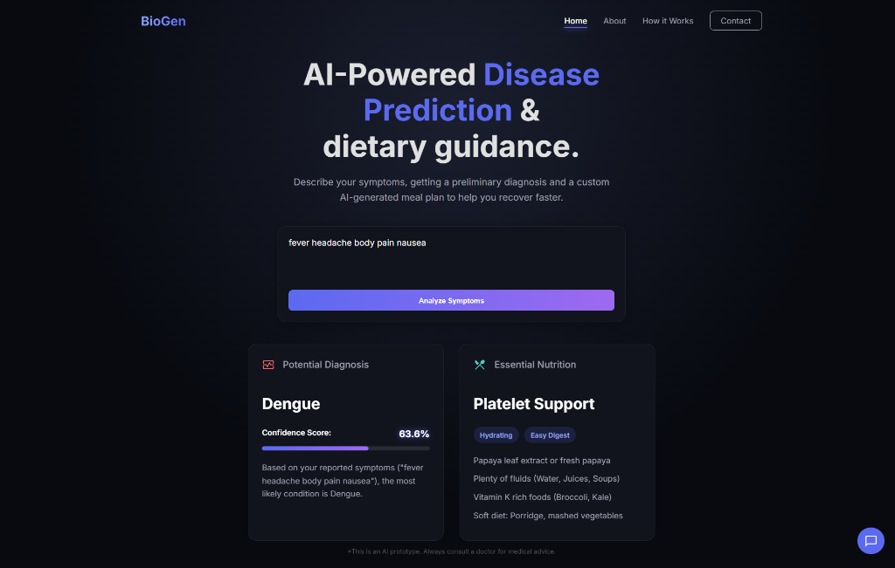
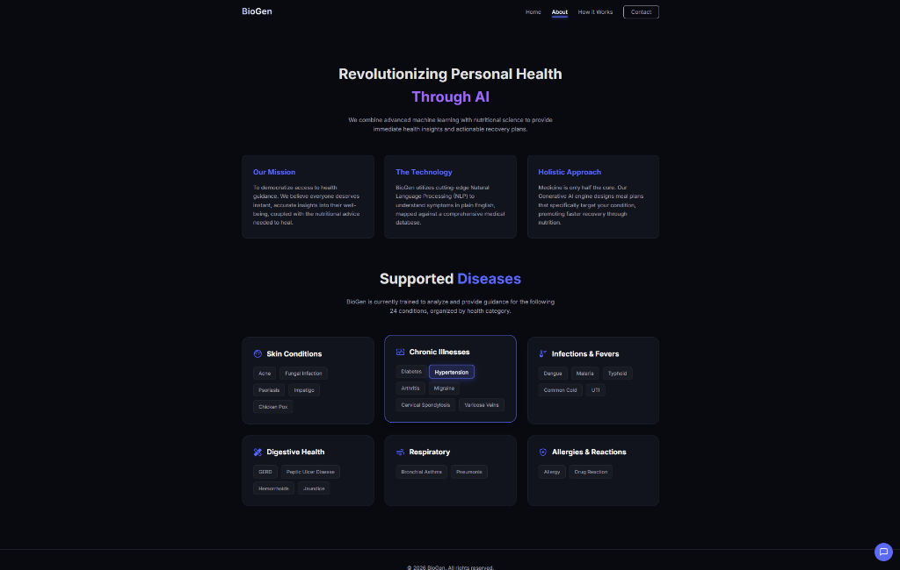
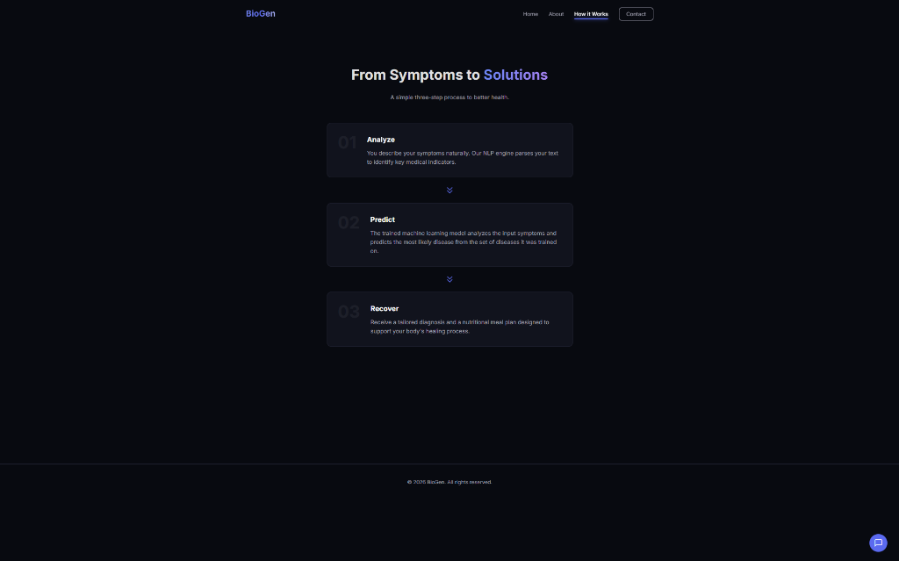

# BioGen: AI-Powered Disease Prediction & Nutrition Guide

**BioGen** is an advanced health assistant that leverages machine learning to predict over 24 different diseases from user-described symptoms. It provides immediate, condition-specific nutritional recovery plans and features an integrated medical chatbot powered by MedGemma-4B-IT for a comprehensive digital health experience.

### 📸 Application Preview

| Home & Diagnosis | About & Diseases | How It Works |
| :---: | :---: | :---: |
|  |  |  |

## 🚀 Features

- **Symptom Analysis**: Leverages a local Scikit-Learn (SVM) model to predict 24 different diseases with high accuracy.
- **Essential Nutrition**: Automatically provides specialized dietary recommendations and health tags for every diagnosis.
- **BioGen AI Chatbot**: Integrated with Hugging Face's `medgemma-4b-it` for general medical inqueries and conversational support.
- **Dynamic UI**: A modern, glassmorphic dark-themed interface with real-time confidence meters and interactive animations.
- **Responsive Design**: Fully optimized for both desktop and mobile viewing.

## 🛠️ Tech Stack

- **Backend**: Python, Flask
- **Machine Learning**: Scikit-Learn (SVM), Joblib, Pandas
- **Frontend**: HTML5, Vanilla CSS3, JavaScript (ES6+)
- **APIs**: Hugging Face Inference API (MedGemma)

## 📦 Installation & Setup

1. **Clone the repository**:
   ```bash
   git clone <repository-url>
   cd "disease prediction"
   ```

2. **Install dependencies**:
   ```bash
   pip install -r requirements.txt
   ```

3. **Configure Environment Variables**:
   Create a `.env` file in the root directory and add your Hugging Face API token:
   ```env
   HF_API_TOKEN=your_huggingface_token_here
   ```

4. **Prepare the Model**:
   Ensure the following files exist in the `model/` directory:
   - `svm_model.pkl`
   - `tfidf_vectorizer.pkl`
   - `label_encoder.pkl`

## 🏃 Running the Application

Start the Flask development server:
```bash
python app.py
```
Visit `http://127.0.0.1:5000` in your browser.

## 🏥 Supported Diseases (24)

BioGen currently supports detailed analysis and nutrition for:
- Acne, Allergy, Arthritis, Bronchial Asthma, Cervical Spondylosis, Chicken Pox, Common Cold, Dengue, Diabetes, Drug Reaction, Fungal Infection, GERD, Hemorrhoids, Hypertension, Impetigo, Jaundice, Malaria, Migraine, Peptic Ulcer Disease, Pneumonia, Psoriasis, Typhoid, UTI, and Varicose Veins.

## ⚠️ Disclaimer
**BioGen is an AI prototype for educational purposes.** The results provided are not a substitute for professional medical advice, diagnosis, or treatment. Always consult with a qualified healthcare provider for any medical concerns.
